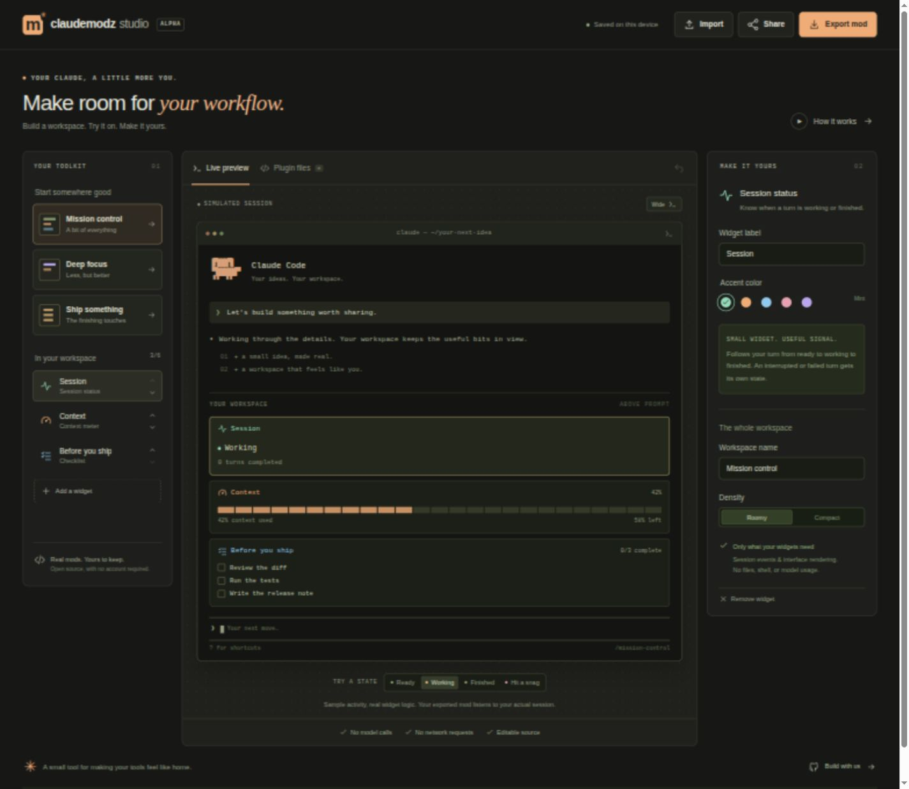

# ClaudeModz Studio

**Build a Claude Code workspace. Preview it. Share a remix. Keep the source.**

Studio is a visual builder for small Claude Code mods. Pick a starter, customize status, context, checklists, notes, budgets, tokens and timing, then download a complete plugin. The editor runs in your browser with no account, API key or backend.



**Early preview:** exported plugins pass Claude's native validation and UI tests. Live use requires Claude Code 2.1.288+ and mods enabled in your profile. A browser preview is a simulation, not a pixel-perfect Claude terminal. See [compatibility and setup](docs/studio.md#compatibility).

## Try Studio

Requires Node.js 24 and pnpm 10.31.0. Claude is only needed to run exported plugins or the native tests.

```sh
git clone https://github.com/claudemodz/claudemodz.git
cd claudemodz
git checkout codex/claudemodz-studio # preview branch, until Studio merges
pnpm install --frozen-lockfile
pnpm dev
```

Open **http://127.0.0.1:5173**.

1. Start with **Mission control**, **Deep focus**, **Ship something**, or **Session insights**.
2. Add and reorder widgets. Change labels, colors, density and checklist items.
3. Try sample session states, then choose **Export mod → Download plugin**.
4. Extract the ZIP. From its parent folder, launch:

```sh
claude --plugin-dir ./mission-control
```

Use your exported folder name if you renamed the workspace. Keep the folder and launch with the same option in future sessions. The export includes a README, license, editable hook source and a `studio.json` you can reimport.

## Made to remix

- **Useful building blocks:** session state and completed turns, measured context usage and optional reported cost, clickable checklists with slash commands, pinned reminders, advisory budget targets, context token counts and turn durations.
- **Try before you export:** ready, working, finished and error scenarios; compact previews; browse every exported file.
- **Portable by default:** plugin ZIP, editable project JSON, and remix links with the configuration in the URL fragment.
- **Local editing:** automatic browser saves and undo. No analytics, model calls, remote fonts or project uploads.
- **Inspectable exports:** no model calls, shell commands, file access or network requests in the generated hooks.

A shared link includes your labels, notes, budget target and checklist text. Review those before sharing. Localhost links only work on the machine running Studio; use JSON between machines until you host the static app. Session activity and checklist completion are not included in exports or links.

## Develop

```sh
pnpm check                 # type checking and all unit/integration tests
pnpm build                 # browser type checking and production build
pnpm test:studio:native    # real Claude validation and native UI tests
pnpm export:example        # validate/test, then write artifacts/mission-control
```

The full suite and native tests require Claude Code. CI pins version 2.1.288. The native script uses a temporary profile and cleans it up; it does not change your personal Claude settings.

The app builds to `apps/studio/dist` and can be served by a static host. See [the Studio guide](docs/studio.md) for installation, troubleshooting, architecture, testing and hosting. See [CONTRIBUTING.md](CONTRIBUTING.md) to help build it.

## Repository

| Path | Purpose |
| --- | --- |
| `apps/studio` | Browser editor, preview, storage and downloads |
| `packages/studio` | Validated project format, shared widget logic and plugin generator |
| `packages/scanner`, `packages/schema` | Existing registry validation and review pipeline |
| `registry` | Commit-pinned plugin listings |

Studio works independently of the registry. Exporting does not publish a marketplace listing; [registry submissions](docs/contributing.md) go through a separate review.

MIT licensed. Independent community project; not affiliated with Anthropic. Claude and Claude Code are Anthropic's trademarks.
